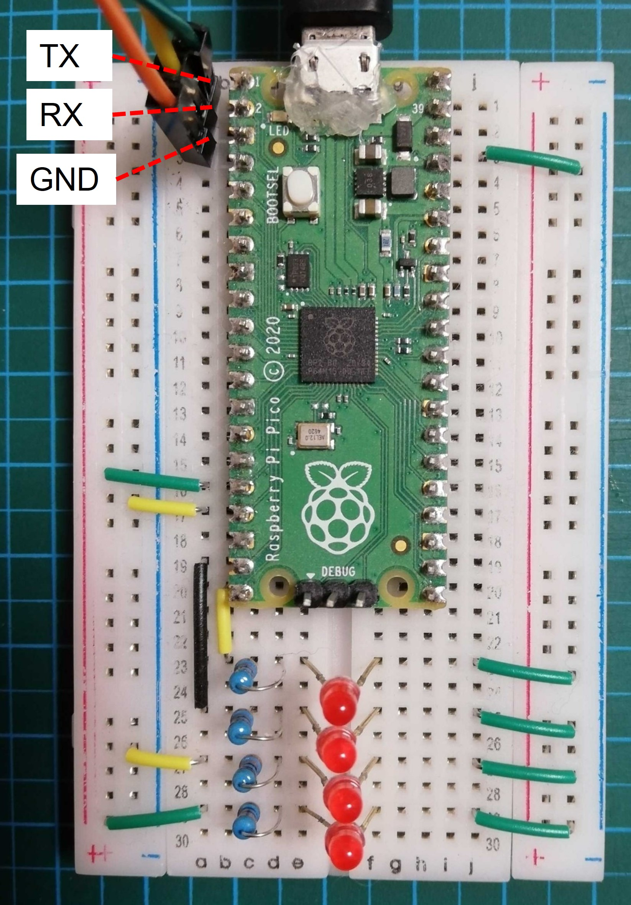

# ERD-light scheduling algorithm on Raspberry Pi Pico FreeRTOS

## build
    $ git clone https://github.com/takahalsuzuki/erd_freertos
    $ cd erd_freertos
    $ git clone -b main https://github.com/FreeRTOS/FreeRTOS-Kernel
    $ git clone -b master https://github.com/raspberrypi/pico-sdk.git
    $ mkdir build
    $ cd build
    $ export PICO_SDK_PATH=../pico-sdk
    $ cmake ..
    $ make

## execution
Connect serial port b/w Rpi Pico and your PC like following: 
 
On PC terminal, baud rate is set to 115200. 
Push BOOTSEL button on RPi Pico and plug USB power charge. 
When copying erd.uf2 to RPi Pico drive, simulation will be performed. 

## ERD simulation
Python based simulatiion is available from here:
https://github.com/takahalsuzuki/erd_single

## references
FreeRTOS porting procedure is referred from following article: 
Interface 2021年8月号 FreeRTOS を載せる方法 / 石岡之也 
https://interface.cqpub.co.jp/magazine/202108/

ERD-light on FreeRTOS is forked from: 
https://github.com/PicoCPP/RPI-pico-FreeRTOS
